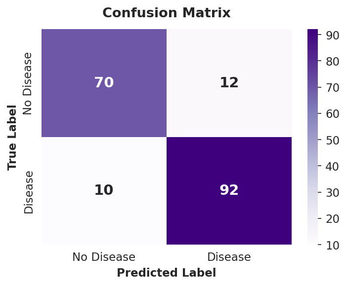
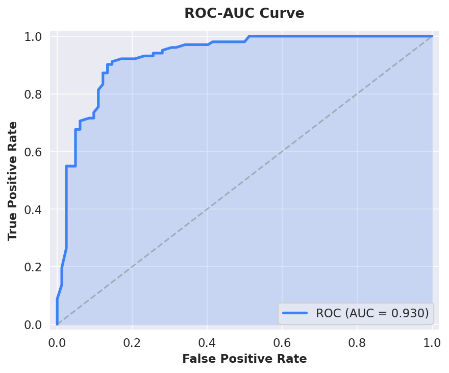
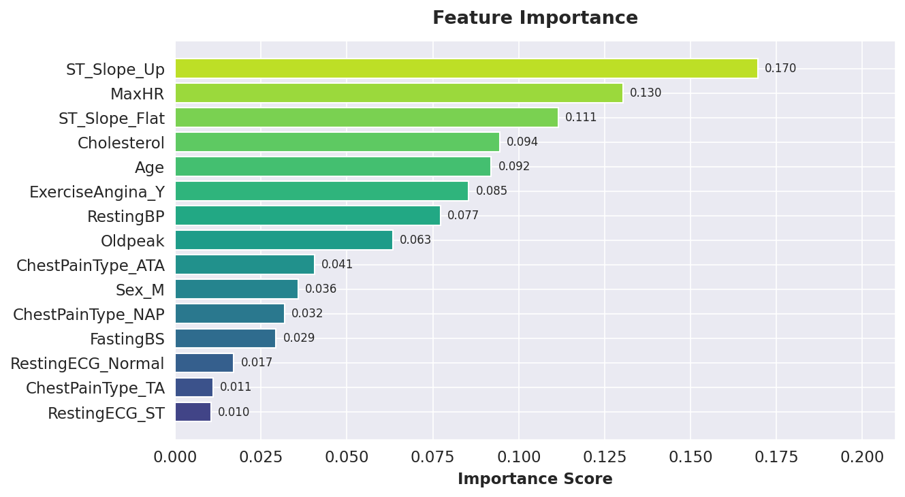
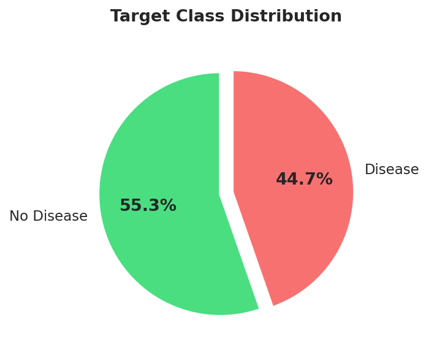
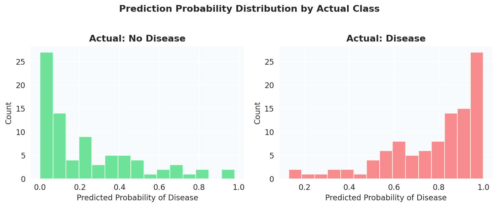

# CardioRisk Predictor

An end-to-end **Machine Learning system** for heart disease prediction with a **React frontend** and **FastAPI backend**. The model achieves **88% accuracy** using a Random Forest classifier trained on patient health metrics.

---

## Tech Stack

| Layer                | Technology                          |
| -------------------- | ----------------------------------- |
| **Frontend**   | React 18, Tailwind CSS              |
| **Backend**    | FastAPI, Uvicorn                    |
| **ML**         | scikit-learn 1.6.1, pandas, numpy   |
| **Model**      | Random Forest (n_estimators=100)    |
| **Deployment** | Render (backend), Vercel (frontend) |

---

## Project Structure

```
ML_Based_Heart_Disease_Predictor/
├── backend/
│   ├── app.py                # FastAPI API server
│   ├── model.pkl             # Trained Random Forest
│   ├── scaler.pkl            # StandardScaler
│   ├── feature_columns.pkl   # Feature names
│   └── requirements.txt
├── frontend/
│   └── index.html            # React SPA (CDN loaded)
├── output/
│   ├── class_distribution.png
│   ├── cm_purple.png
│   ├── feat_imp_viridis.png
│   ├── roc_blue.png
│   └── prob_distribution.png
├── CardioRisk_Predictor.ipynb
├── heart.csv
├── requirements.txt
├── .gitignore
└── start.sh
```

---

## Model Performance

### Confusion Matrix



### ROC Curve (AUC: 0.94)



### Feature Importance



### Class Distribution



### Prediction Probability Distribution



---

## Dataset

The dataset (`heart.csv`) contains **918 patient records** with **11 features**:

| Feature        | Type        | Description                       |
| -------------- | ----------- | --------------------------------- |
| Age            | Numerical   | Patient age (28–77)              |
| Sex            | Categorical | M / F                             |
| ChestPainType  | Categorical | ATA, NAP, TA, ASY                 |
| RestingBP      | Numerical   | Resting blood pressure            |
| Cholesterol    | Numerical   | Serum cholesterol                 |
| FastingBS      | Binary      | Fasting blood sugar > 120 mg/dL   |
| RestingECG     | Categorical | Normal, ST, LVH                   |
| MaxHR          | Numerical   | Max heart rate achieved           |
| ExerciseAngina | Binary      | Exercise-induced angina (Y/N)     |
| Oldpeak        | Numerical   | ST depression induced by exercise |
| ST_Slope       | Categorical | Up, Flat, Down                    |

**Target:** `HeartDisease` (0 = No Disease, 1 = Disease)

---

## How to Run Locally

### 1. Clone

```bash
git clone https://github.com/Ujjval009/ML-Based-Heart-Disease-Predictor.git
cd ML-Based-Heart-Disease-Predictor
```

### 2. Environment

```bash
python3 -m venv venv
source venv/bin/activate
pip install -r requirements.txt
```

### 3. Run Notebook (EDA + Training)

```bash
jupyter notebook CardioRisk_Predictor.ipynb
```

### 4. Start Backend

```bash
cd backend
uvicorn app:app --host 127.0.0.1 --port 8000 --reload
```

### 5. Start Frontend

```bash
cd frontend
python3 -m http.server 3000
```

Open **http://127.0.0.1:3000** in your browser.

---

## API Reference

### `POST /predict`

**Request body:**

```json
{
  "Age": 54,
  "Sex": "M",
  "ChestPainType": "NAP",
  "RestingBP": 130,
  "Cholesterol": 223,
  "FastingBS": 0,
  "RestingECG": "Normal",
  "MaxHR": 138,
  "ExerciseAngina": "N",
  "Oldpeak": 0.6,
  "ST_Slope": "Up"
}
```

**Response:**

```json
{
  "prediction": 0,
  "risk": "Low",
  "probability_no_disease": 0.66,
  "probability_disease": 0.34
}
```

---

## Deployment

### Backend → Render

1. Push code to GitHub
2. Go to [render.com](https://render.com) → **New Web Service**
3. Connect your repo
4. Configure:
   - **Root Directory**: `backend`
   - **Build**: `pip install -r requirements.txt`
   - **Start**: `uvicorn app:app --host 0.0.0.0 --port $PORT`

### Frontend → Vercel

1. Go to [vercel.com](https://vercel.com) → **Add New Project**
2. Import your repo
3. **Root Directory**: `frontend`
4. Update the API URL in `frontend/index.html` to point to your Render URL

## License

This project is for **educational purposes only**. Not a substitute for professional medical advice.


## Author

**Ujjval007** — [GitHub](https://github.com/Ujjval009)
